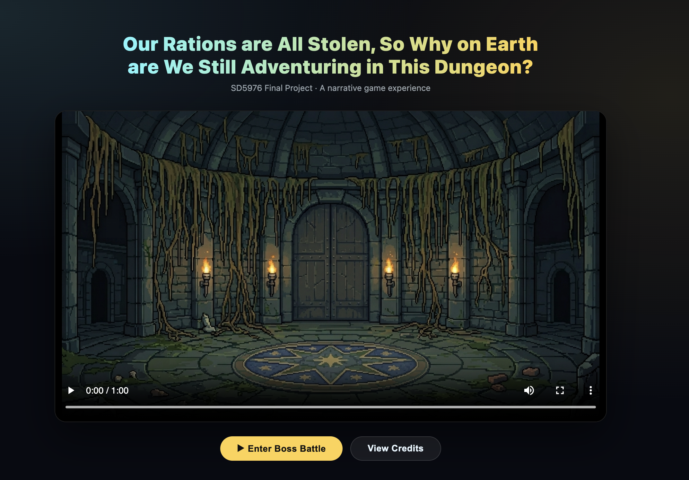

# Our Rations are All Stolen, So Why on Earth are We Still Adventuring in This Dungeon?

**SD5976 Final Project**

[▶ Open the complete interactive experience](final.html) · [Play the boss battle](game/index.html)




---

## Overview

An interactive narrative experience combining AI-generated short films and a browser-based mini-game, presented as a single HTML webpage.

The experience flows as:

1. **Prologue (AI short film ~90s):** Introduces the four characters, the dungeon world, Mr. Star's betrayal, and the journey to the final chamber
2. **Game Stage 1:** Two players cooperate to defeat the Dragon — the dungeon's first great boss
3. **Cutscene:** Dragon falls; Mr. Star absorbs its dark power and transforms into boss form
4. **Game Stage 2:** Fight Mr. Star in complete form — Mr. Star cannot be selected as a player character
5. **Ending (AI short film ~60s):** Win → Ending A (Mr. Star moved by teammates' bonds, expels dark power, adventure continues); Lose → Ending B (teammates defeated, world becomes food planet)

**Total video runtime: ~3.5 minutes (~210 seconds)**

---

## How to Run

Open `final.html` in a browser. No installation or server required.

> The game alone (without videos) can be run from `game/index.html`.

> Edited video files are in `videos/Edited/`. Ensure the filenames referenced in `final.html` match those in that folder.

---

## Characters

| Character | Race | Class | Goal |
|-----------|------|-------|------|
| **Mr.Star** | Magical creature, dog-bear hybrid | Cute pet / Secret Boss | Reclaim dark power; turn the entire world into food |
| **Cheri** | Elf | Monk / Mage | Discover his true self and escape the temple he grew up in |
| **Enos** | Half-elf | Wizard | Gather materials for his graduation thesis |
| **Oreo** | Catfolk | Ninja-Assassin | Find the legendary medicine to cure her ninja grandfather |

Character reference: [polyu-storyworld](https://github.com/venetanji/polyu-storyworld/tree/main/characters)

---

## Story Summary

Enos leads a peculiar party deep into the underground dungeon for his graduation thesis. Mr. Star joins as the team mascot — incredibly huggable, and supposedly useful for detecting dark power. What the team does not know: Mr. Star was once human, his soul now possessing a 42cm dog-bear hybrid body, and his one true goal is to obtain the dungeon's dark power and turn the entire world into food.

After surviving the brutal Void Hole challenge, the exhausted team falls asleep — and wakes to find every ration gone. Mr. Star, bloated and crumb-covered, can no longer hide the truth. The team pushes on regardless, reaching the dungeon's final chamber: the Dragon. When the dragon falls, its dark power floods into Mr. Star. The transformation begins. The real final battle starts.

---

## Project Structure

```
final_project_SD5976/
│
├── final.html                          # Main entry: prologue → game → ending
├── README.md
├── cover.JPG                           # Project cover image
├── story_outline.png                   # Story overview diagram
│
├── game/                               # Boss battle mini-game (zero-dependency HTML)
│   ├── index.html
│   ├── character_pixel/                # Pixel character sprites (PNG)
│   │   ├── dog.PNG                     # Mr.Star
│   │   ├── dog_weapon.png
│   │   ├── wizard.PNG                  # Enos
│   │   ├── wizard_weapon.png
│   │   ├── knight.PNG                  # Cheri
│   │   ├── knight_weapon.png
│   │   ├── cat.PNG                     # Oreo
│   │   ├── cat_weapon.png
│   │   ├── dragon.png                  # Stage 1 boss
│   │   ├── boss2.PNG                   # Mr.Star boss form (Stage 2)
│   │   ├── boss2_bomb.PNG
│   │   ├── boss1_bomb.png
│   │   └── Pixel_of_4.PNG
│   ├── stages/                         # Background and result screens
│   │   ├── background.png
│   │   ├── black1.jpeg
│   │   ├── black2.jpg
│   │   ├── star_black.jpeg
│   │   ├── gamewin_1.jpg
│   │   ├── gamewin_2.jpg
│   │   ├── gameover_1.jpg
│   │   └── gameover_2.png
│   ├── music/                          # Battle and result BGM/SFX
│   │   ├── Battle1_Shatter the Core.mp3
│   │   ├── Battle2_Void Hunger.mp3
│   │   ├── black.mp3
│   │   ├── victory.mp3
│   │   └── fail.mp3
│   └── README.md
│
├── videos/                             # AI-generated short films and raw clips
│   ├── Edited/                         # Final edited videos used in final.html
│   │   ├── Opening.mp4
│   │   ├── Prologue.mp4
│   │   ├── Boss2 CG.mp4
│   │   ├── HE_A.mp4                    # Ending A — Victory
│   │   └── BE EndingB.mp4             # Ending B — Defeat
│   ├── [raw clip files].mp4            # Unedited AI-generated clips (SEE DANCE 2.0 output)
│   ├── Narration.mp3                   # Narration audio
│   ├── narration2.mp3
│   ├── Narratione.mp3
│   ├── NoteGPT_Speech_*.mp3
│   └── README.md
│
├── storyboard/                         # Storyboard scripts and key frames
│   ├── README.md                       # Scene-by-scene overview
│   ├── text/                           # AI video text prompts (bilingual EN/中文)
│   │   ├── prologue.md                 # 9 scenes × ~10s
│   │   ├── ending_a.md                 # 4 scenes × ~15s (victory)
│   │   ├── ending_b.md                 # 4 scenes × ~15s (defeat)
│   │   └── narration.txt               # Narration script
│   └── frames/                         # First/last frame images for SEE DANCE 2.0 / Lovart
│       ├── prologue/
│       ├── ending_a/
│       └── ending_b/
│
├── character_pics/                     # Character reference artwork
│   ├── Mr.Star/
│   ├── cheri/
│   ├── enos/
│   └── oreo/
│
├── group_work_contribution_and _workflow/   # Per-member work documentation
│   ├── 25057915g_LIYanling/            # LI Yanling
│   │   ├── README.md                   # Contribution overview
│   │   ├── prompts.md                  # Prompt records
│   │   ├── reflection.md               # AI tool reflection
│   │   ├── workflow_1.png
│   │   ├── workflow_2.png
│   │   └── workflow_3.png
│   ├── 25053695g_PANYiting/            # PAN Yiting
│   │   ├── README.md
│   │   ├── prompts.md
│   │   ├── reflection.md
│   │   ├── workflow1.png
│   │   └── workflow2.png
│   ├── 25054114g_SHENZiqi/             # SHEN Ziqi
│   │   ├── README.md
│   │   ├── prompts.md
│   │   ├── reflection.md
│   │   └── workflow.png
│   └── 25042425g_WANGDongni/           # WANG Dongni
│       ├── Contruibution.md
│       ├── reflection.md
│       ├── agent_text_to_image.png
│       ├── ai_platfrom_image_to_image.png
│       ├── comfyui_workflow_audio.jpg
│       └── cursor_vibecoding.png
│
├── ppt/                                # PPT slides
├── presentation/                       # Presentation materials
│   └── README.md
```

---

## Team Responsibilities

| Member | Tasks |
|--------|-------|
| **LI Yanling — 25057915g** | Project file architecture · Storyboard text prompts (all 3 videos, bilingual) · Main story content · `final.html` HTML display · PPT opening & story background slides |
| **PAN Yiting — 25053695g** | Cheri character segment · Storyboard generation · Video generation · Presentation PPT · Prologue& Ending A short film production and editing · Workflow docs |
| **SHEN Ziqi — 25054114g** | Enos character segment · Ending B short film production · Workflow docs |
| **WANG Dongni — 25042425g** | Game code (`game/index.html`) · Music generation (ComfyUI ACE-Step) · Game asset generation · `final.html` video integration · Win/lose logic · Workflow docs |

---

## AI Tools Used

| Tool | Purpose |
|------|---------|
| **SEE DANCE 2.0 (Jimeng AI)** | AI image generation for storyboard keyframes (first frame / last frame); also used for video clip generation |
| **Lovart** | AI video generation from image pairs + motion prompts |
| **ComfyUI ACE-Step 1.5** | Battle and result music/SFX generation |
| **Cursor** | Vibe coding for game development (`game/index.html`) |
| **Claude Code** | Storyboard prompt writing assistance, HTML integration |

---

## Video Production Workflow

```
Story script (storyboard/text/*.md)
        ↓
Generate first frame image — SEE DANCE 2.0   [First frame image]
Generate last frame image  — SEE DANCE 2.0   [Last frame image]
        ↓
Upload first + last frame to Lovart
Input motion prompt
        ↓
Export video clip (~10–15s per clip)
        ↓
Edit and assemble clips → final .mp4
        ↓
Place in videos/ folder
```

Each scene in `storyboard/text/` contains **4 elements per clip**:
- First Frame Prompt (EN)
- Last Frame Prompt (EN)
- Motion Prompt (EN)
- Story Narration (EN)

---

## Assessment Criteria

| Criterion | How We Address It |
|-----------|------------------|
| Value / Novelty (25%) | Original game + AI narrative films; unique dual-ending interactive structure |
| GitHub repo — code works (50%) | `final.html` + `game/index.html` both run in-browser, zero dependencies |
| GitHub repo — workflow documented (50%) | `group_work_contribution_and _workflow/` — prompts + reflections for all 4 members |
| Uses polyu-storyworld / MCP (50%) | Characters sourced from [venetanji/polyu-storyworld](https://github.com/venetanji/polyu-storyworld) |
| All members contributed (50%) | Each member has their own workflow folder with documented process |
| Reflection (25%) | `*/reflection.md` — AI tool impact on pipeline, quality, and authorship |

---

#### Links

- Character database: [polyu-storyworld](https://github.com/venetanji/polyu-storyworld/tree/main/characters)
- Videos (external): (Fill in Google Drive or other sharing link)
